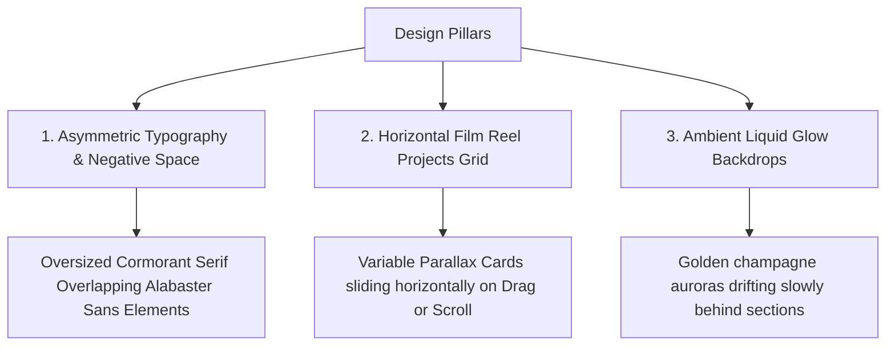

# Cinematic Editorial Portfolio: Groundbreaking Redesign Plan

This plan introduces an elite, highly unique, and groundbreaking interactive structure for Ayush Mistry's portfolio. Moving away from standard vertical blocks, we will implement a **Cinematic Editorial Concept** featuring variable-direction layouts, horizontal parallax film reels, asymmetric typographic layouts, and interactive liquid-glow backdrops.

---

## The Design Concept: "The Cinematic Director's Cut"

This redesign is modeled after high-end European design agency sites. It centers on three unique design pillars:

### Key Unique Structural Upgrades:
1. **The Navigation Dock**: A floating glassmorphic deck at the bottom center of the viewport that feels like a camera lens dial, containing micro-interactive state indicators.
2. **Variable-Scroll Projects Reel (`ProjectGrid.jsx`)**: Instead of a vertical grid, projects are displayed on a **continuous horizontal parallax film reel**. Users can drag or scroll horizontally. The thumbnails dynamically rotate and scale based on scroll position!
3. **The Director's Grid (`Intro.jsx` & `Stats.jsx`)**: The intro is split into an asymmetric layout with deep negative space and oversized serif characters that overlap high-fidelity grid outlines.
4. **Liquid Glow Backdrop Layers**: Ambient light spots that track the cursor or drift on a soft sine-wave path behind sections, adding an immersive volumetric lighting effect to the dark theme.

---

## Proposed Changes

We will restructure the main portfolio sections into this cinematic flow.

### [MODIFY] [tailwind.config.js](file:///d:/photography-portfolio-enhanced/frontend/tailwind.config.js)
* Configure custom animations: `liquid-drift` (sine-wave backdrop drift), `text-up-reveal`.
* Refine typographic spacing scale for editorial layouts.

### [MODIFY] [CustomCursor.jsx](file:///d:/photography-portfolio-enhanced/frontend/src/components/CustomCursor.jsx)
* Add a luxury liquid distortion wave effect to the outer ring using CSS filter blurs.
* Hovering on media causes the cursor dot to turn into a high-end golden circular badge with crosshair ticks like a camera view-finder.

### [MODIFY] [Hero.jsx](file:///d:/photography-portfolio-enhanced/frontend/src/components/Hero.jsx)
* Transition from standard text to an asymmetric **split-curtain intro reveal**. Upon page entry, the screen splits horizontally like an opening lens shutter, revealing the hero image in the center.

### [MODIFY] [ProjectGrid.jsx](file:///d:/photography-portfolio-enhanced/frontend/src/components/ProjectGrid.jsx)
* Restructure into a **Horizontal Drag-and-Scroll Film Reel**:
  * Implement touch and mouse drag-to-scroll controls via Framer Motion spring physics.
  * Card items feature dynamic parallax tilting (slight 3D rotation based on mouse cursor distance).

### [MODIFY] [Gallery.jsx](file:///d:/photography-portfolio-enhanced/frontend/src/components/Gallery.jsx)
* Redesign into an **Asymmetric Masonry Board** where rows do not align, creating a premium magazine feel.
* Add clean category switches with subtle glowing underlines.

### [MODIFY] [Intro.jsx](file:///d:/photography-portfolio-enhanced/frontend/src/components/Intro.jsx) & [Stats.jsx](file:///d:/photography-portfolio-enhanced/frontend/src/components/Stats.jsx)
* Merge into a single high-end **"Visual Statement"** section combining biography elements and clean numbers in a geometric, Bauhaus-style blueprint grid.

### [MODIFY] [Services.jsx](file:///d:/photography-portfolio-enhanced/frontend/src/components/Services.jsx)
* Redesign into a **Dynamic Accordion Slider**: Clicking a service expands that column sideways (horizontal accordion) to reveal large cinematic details and visual items, collapsing the other two.

### [MODIFY] [Contact.jsx](file:///d:/photography-portfolio-enhanced/frontend/src/components/Contact.jsx)
* Overhaul form fields to use floating text labels and deep glass panels with golden ambient drop-shadow highlights.

---

## Verification Plan

### Automated Checks
* Run production compiler (`npm run build`) to ensure that all layout properties, horizontal physics variables, and drag hooks are structurally sound.

### Manual Verification
* Test drag and scroll interactions on mobile touch vs desktop cursors.
* Verify dynamic scaling on the services horizontal accordion.
